# HomeServer-Guide
This is a guide for individuals who want to convert their old PC into a Home Server using free and open-source tools.

## Purpose of Creating This Repository

- Setting up a home server can be overwhelming due to the vast amount of information available online. This guide aims to simplify the process by consolidating essential steps and resources in one place.

- Finding the right resources and services that can be easily integrated and are truly useful took a lot of my time.
  
- I want to help people save time by providing a step-by-step guide.


## Requirements
1. An old PC or any PC you want to convert into a server.
2. A USB drive (≥ 16GB).
3. A Wi-Fi router with an internet connection.

## Overview
This is what we are going to set up:

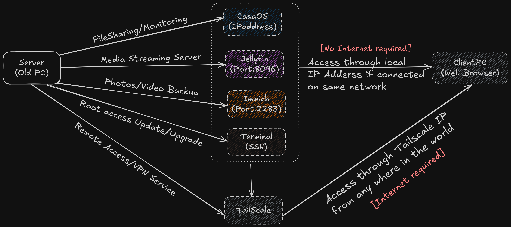

## Setup 
### Step1: Setting up UBUNTU SERVER OS
1. Download Ubuntu server ISO (LTS version) from:
   https://ubuntu.com/download/server
2. Make bootable pendrive using [Rufus](https://rufus.ie/en/)
3. Boot your server(Old PC) from the pendrive and start setting up the ubuntu server on your system.

>[!IMPORTANT]
>Ensure you select "Install OpenSSH Server" while installing Ubuntu Server OS.
>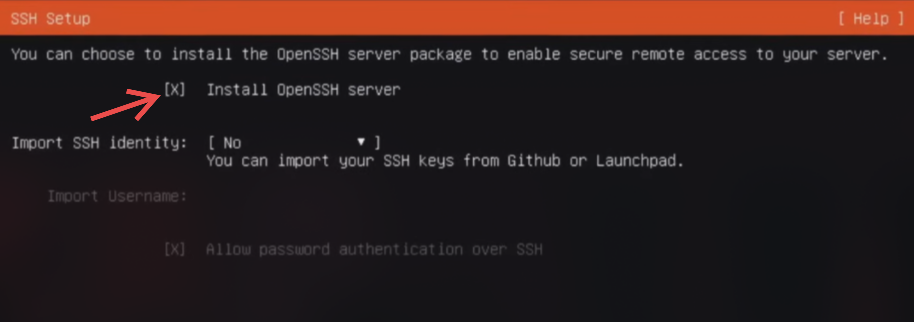  

Reference Video [HERE](https://youtu.be/0-T7af_lRF8?feature=shared)

### Step2: DHCP IP Binding/Static IP
> [!IMPORTANT]
> This ensures your server always receives the same IP address assigned during installation. Otherwise, DHCP will automatically assign a different IP each time, requiring you to reconfigure settings.

> [!TIP]
> Router settings may vary. Look for options like "IP Reserve" or "Static IP."

=> Open your router's settings by entering the default gateway IP address in a web browser. <br>
=> To find your router's IP address, enter the following command in the terminal:
- for Windows 
  
   ```Shell 
   ipconfig 
   ``` 
- for Linux
  
  ```Shell
  ifconfig
  ``` 

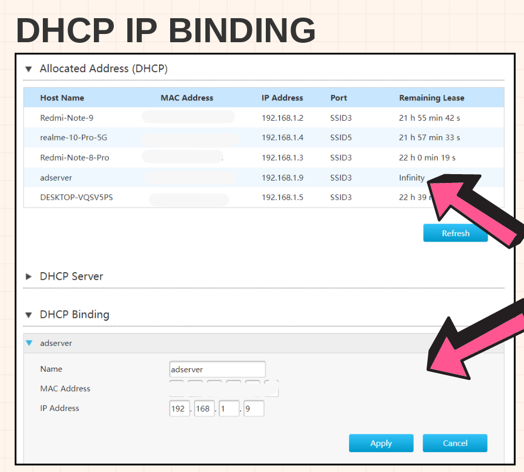

---

### Step3: Configuring SSH

=> A network protocol that allows users to securely access and manage remote computers.

1. Install OpenSSH on Ubuntu Server using the following command in terminal

```Shell
sudo apt install openssh-server
```

2. Check ssh status 
```Shell
sudo systemctl status sshd
```
>[!TIP]
>If above command doesn't work,try:
>```Shell
>sudo systemctl status ssh
>```

3. Start ssh service:
 
```Shell
sudo systemctl start sshd
```
4. Enable SSH to start automatically at boot:

```Shell
sudo systemctl enable sshd
```  
5. Check username of ubuntu server:

```Shell
whoami
```
6. Check the server’s IP address:

```Shell
hostname -I
```
--- 

=> To remotely access the terminal from a client device, enter following commands in the terminal of Client PC:

```sudo ssh username@device_ipaddress``` <br>

Eg:
`sudo ssh adserver@192.168.1.9`

- Then update and upgrade the system :
  
  ```Shell
  sudo apt update
  ```
  
  ```Shell
  sudo apt upgrade
  ```

Reference Video :[HERE](https://youtu.be/3FKsdbjzBcc?feature=shared)

---

### Step4: Setting up CasaOS

=> [CasaOS](https://casaos.zimaspace.com/) provides a user-friendly dashboard to manage your server and supports apps in the form of Docker containers.

- Install CasaOS with the following command:

```
curl -fsSL https://get.casaos.io | sudo bash
```
Reference Github:[HERE](https://github.com/IceWhaleTech/CasaOS)

=> After Setup, enter the server's IP in any browser to access the CasaOS dashboard.


<div align="center"><table><tr>CasaOS</tr><tr><td>
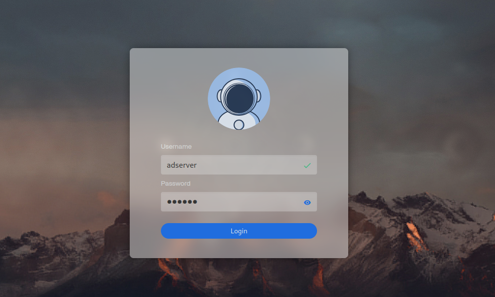</td><td>
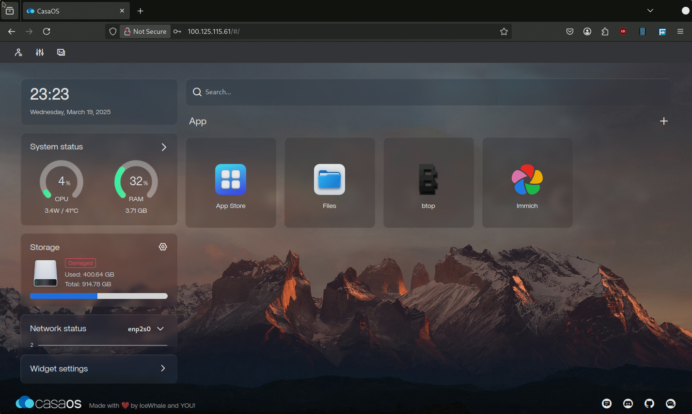</td></tr></table></div>

---

### Step5: File Sharing Through CasaOS
- CasaOS simplifies Samba file sharing.
1. Click the "Files" icon on CasaOS Dashboard.
2. Then select the folder which you want to share and click "Share".
3. Copy the path and paste it in Windows File Explorer. 


<div align="center"><table><tr>CasaOS Files</tr><tr><td>
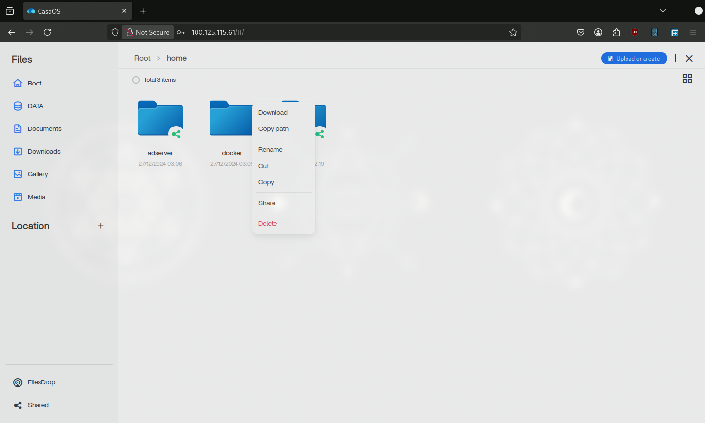</td><td>
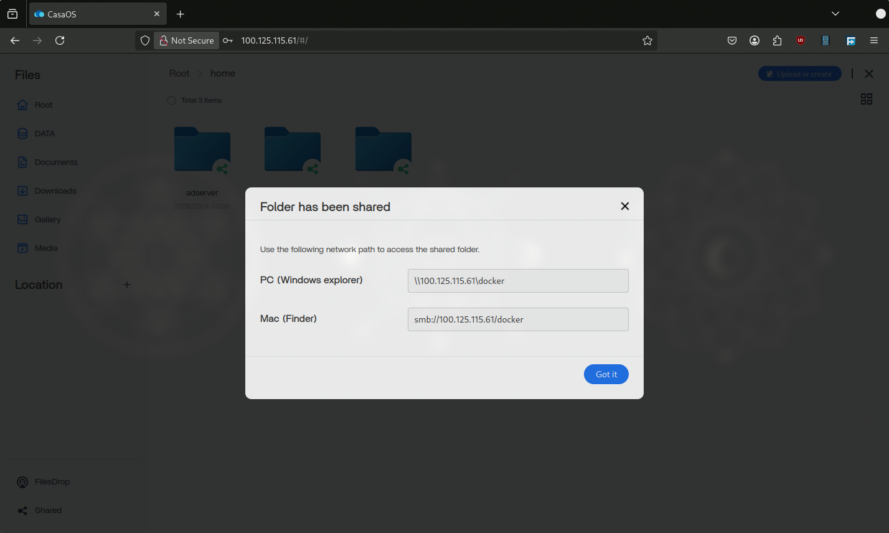</td></tr></table></div>

4. Check "Connect using different credentials".

<div align="center"><table>
<tr>Map Network Drive</tr>
<tr>
<td>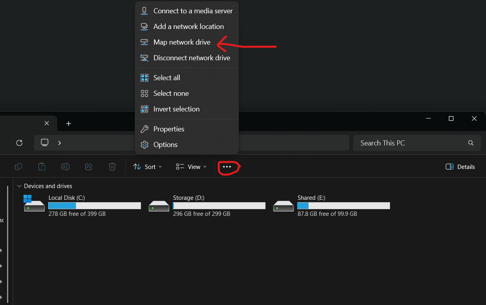</td>
<td>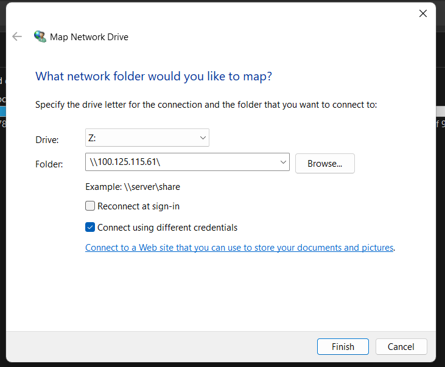</td>
</tr>
</table></div>

5. Then enter the same credentials which you set while configuring ubuntu server OS

<div align="center"><table>
<tr>Accessing in Windows</tr>
<tr>
<td>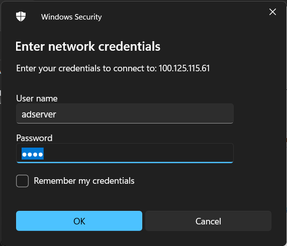</td> 
<td>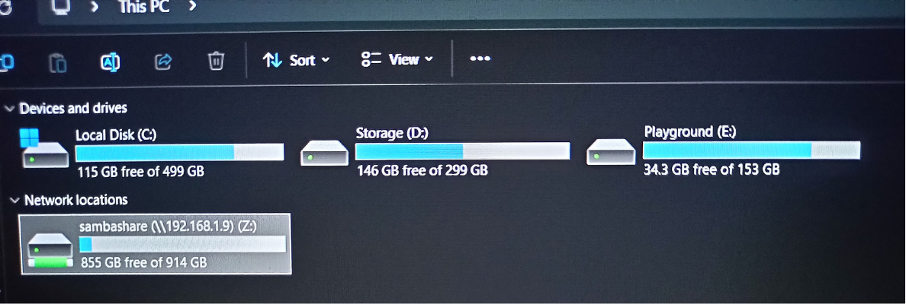</td> 
</tr>
</table></div>

---

### Step6: Setting Up a Media Server
=> Creating media server will give you freedom to stream your media on any device and anywhere.

=> We will integrate [Jellyfin](https://jellyfin.org/) 
- It automatically identifies the movie/series and provide metadata,ratings ,etc.

=> Open CasaOS Dashboard and install jellyfin through AppStore

=> Enter the below given address in any browser to access jellyfin server <br>
  `http://localhost:8096`

<div align="center">Jellyfin on web browser</div>
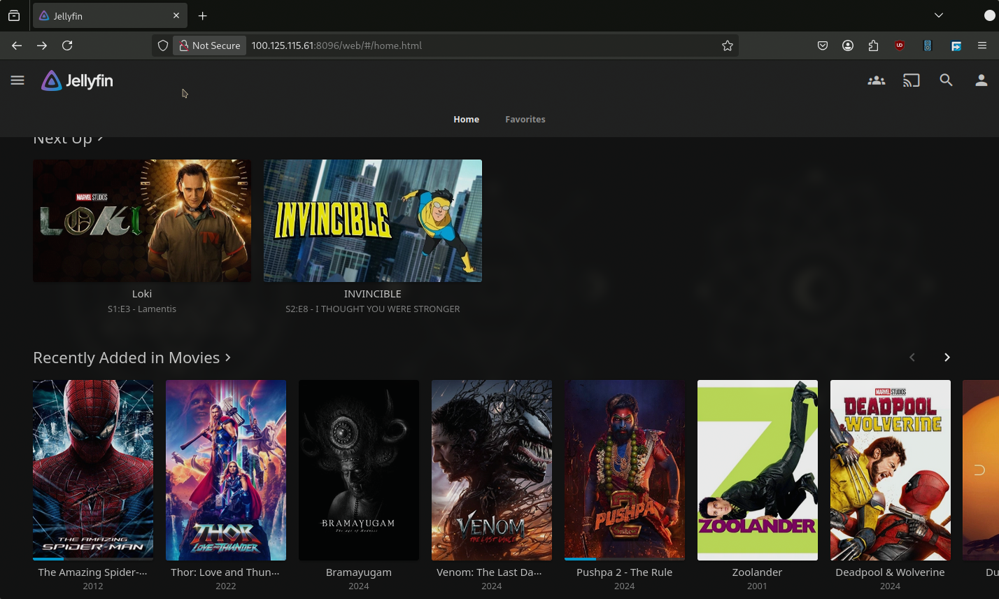


<div align="center"><table><tr>Jellyfin App on Android</tr>
<tr><td>
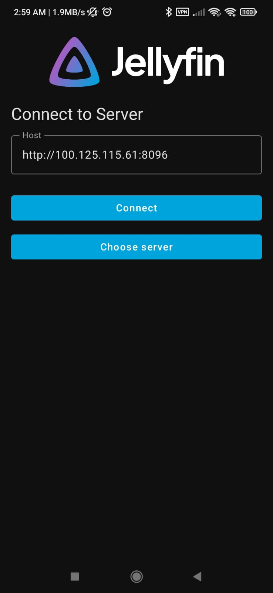</td><td>
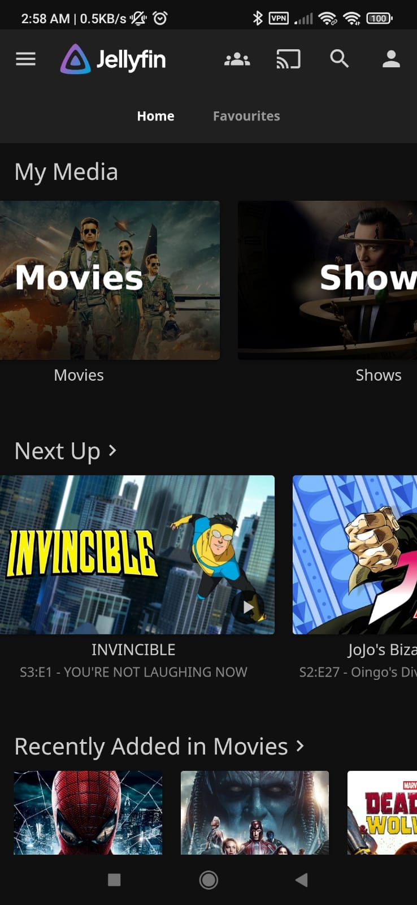</td></tr></table></div>


--- 

- Directories/Folders Structure example for jellyfin
  
```
Media
├── Movies
└── Series
    ├── Series1_Folder
    |    ├── Season1
    |    └── Season2
    └── Another_Series2_Folder
```
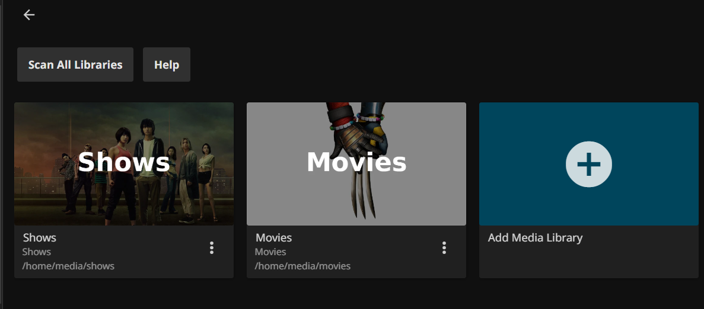

<br>

- Alternative Method for installing Jellyfin <br>
=> CLI Method : Directly installing jellyfin on Ubuntu Server through terminal
https://jellyfin.org/docs/general/installation/linux/

---

### Step7: Remotly accessing server from anywhere in the world 
- One of the most simplest way to achieve this is by integrating [Tailscale](https://tailscale.com/)

> [!CAUTION]
> Do not use CasaOS for installing tailscale use terminal instead

<br>

1. Commands for installing tailscale on Ubuntu Server:

```shell
curl -fsSL https://tailscale.com/install.sh | sh
```
2. Connect your server to your Tailscale network:

```shell
sudo tailscale up
```

3. Find your Tailscale IPv4 address:
  
```shell
tailscale ip -4
```

>[!TIP]  
>If the device you added is a server or remotely-accessed device, you may want to consider [`DISABLING KEY EXPIRY`](https://tailscale.com/kb/1028/key-expiry) to prevent the need to periodically re-authenticate.

Reference Video: [HERE](https://youtu.be/sPdvyR7bLqI)

<div align="center"><table>
<tr>Tailscail Dashboard</tr>
<tr>
<td>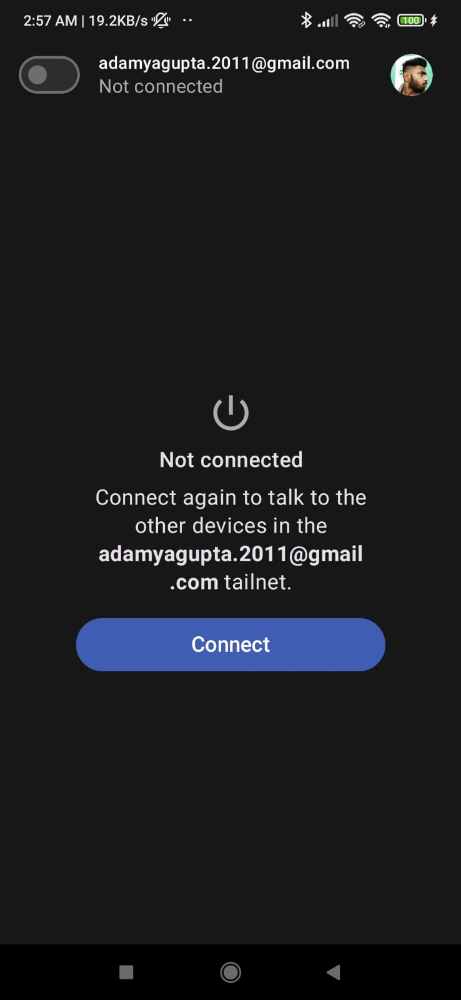</td>
<td>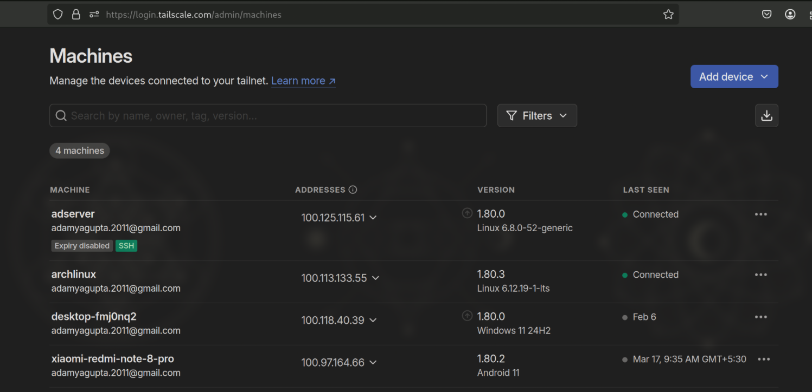</td>
</tr>
</table></div>

---

### Step8: Setting up Immich
- [Immich](https://immich.app/) is a great alternative to Google Photos.
- Easily back up, organize, and manage your photos on your own server.

=> Open CasaOS Dashboard and install Immich through AppStore

- Enter the below given address in any browser to access Immich<br>
  `http://localhost:2283`

<div align="center">Immich Dashboard</div>
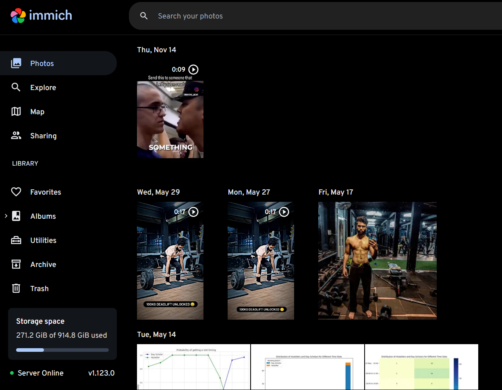

<br>

>[!TIP]
>Turn on `STORAGE TEMPLATE ENGINE` from settings, If you want your photos should be organised in proper folder instead of some random order of encryption.
>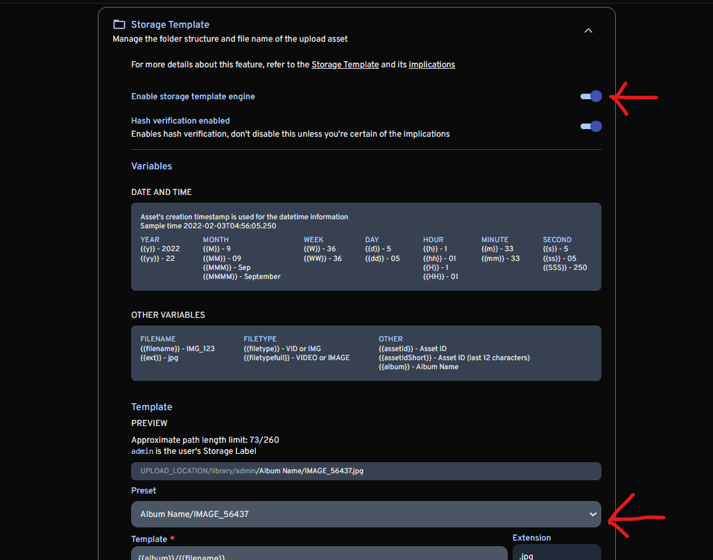

---

### Step9: Further Scope of Advancement
- AI Server: Can setup `OpenWebUI` with `Ollama` LLM models to have your own chatbot running on your own server.
- Ebook Server: Can Use [Calibre-Web](https://github.com/janeczku/calibre-web) (Open Source alternative to kindle)
- Automatic torrent Downloads using Prowlarr, Sonarr, Radarr etc:[Reference](https://zerodya.net/self-host-jellyfin-media-streaming-stack/) 


- Home automation : Using [NEXTCLOUD](https://nextcloud.com)

## Conclusion

By following this guide, you can successfully repurpose your old PC into a powerful and efficient home server. With services like CasaOS, Jellyfin, and Immich, you can easily manage files, stream media, and back up your data. Remote access through Tailscale ensures your server is accessible from anywhere, making it a versatile addition to your home network. Explore further advancements to expand your server’s functionality. <br>

If you found this guide useful, please ⭐ star this repository on GitHub to help others discover it! <br>
Happy hosting!

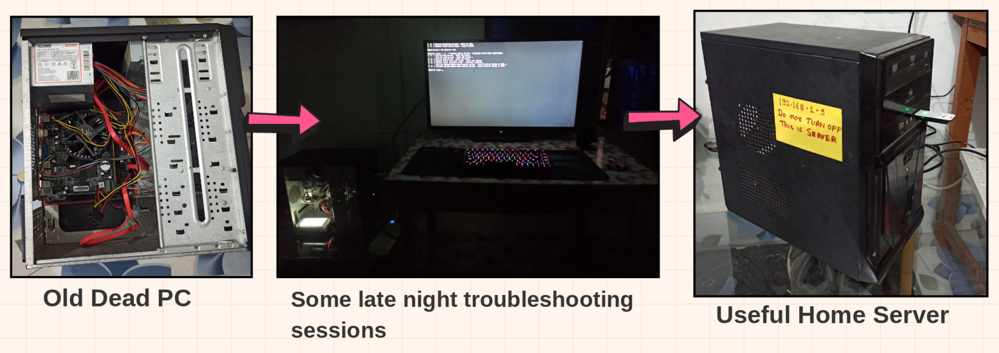

---