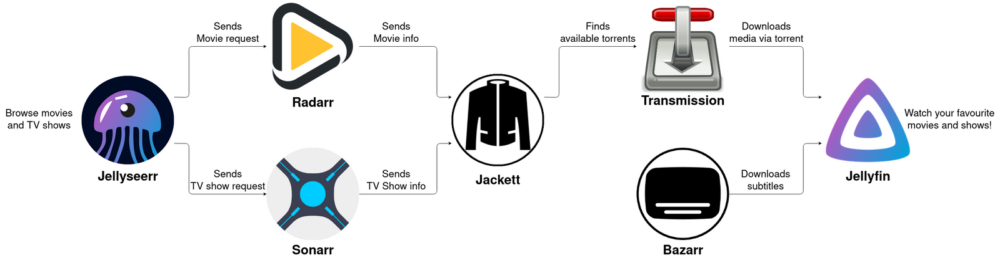

# HomeServer-Guide
This is a guide for those individuls who want to convert their old PC into a HomeServer using free and open source tools.

## Purpose for creating this repository
- It took a lot of my time finding the right resources and services which can be integrated easily and are really useful.
  
- I want to help people save time and give them a step by step guide.

## Requirements
1. Old PC or any pc you want to convert into a server
2. Pendrive >= 16GB
3. Wifi Router with Internet connection

## Setup 
### Step1: Setting up UBUNTU SERVER OS
1. Download Ubuntu server ISO (LTS version)  from:
   https://ubuntu.com/download/server
2. Make bootable pendrive using [Rufus](https://rufus.ie/en/)
3. Boot your server(Old PC) from the pendrive and start setting up the ubuntu server on your system  

Reference Video [HERE](https://youtu.be/0-T7af_lRF8?feature=shared)

### Step2: DHCP IP Binding / Static IP
> [!IMPORTANT]
> This will ensure that your server always gets the same IP address which you assigned during installation , otherwise DHCP will automatically assign different IP everytime and you to reroute everything to a new IP address everytime.

> [!TIP]
> Every router has little different admin settings so names can be like IP Reserve , Static IP , etc.  
- Open your routers Setting 
- by entering default gateway ip adderess in a browser 
- to check your routers ip address enter this command in terminal 
- for Windows 
   ```Shell 
   ipconfig 
   ``` 
- for linux
  ```Shell
  ifconfig
  ``` 
<div align="center"><table><tr>To check your routers ip address enter this command in terminal</tr><tr><td>
for Windows

   ```Shell 
   ipconfig 
   ``` 
   </td><td>
for Linux

  ```Shell
  ifconfig
  ``` 
  </td></tr></table></div>


### Step3: Configuring SSH

=> A network protocol that allows users to securely access and manage remote computers.

- Install OpenSSH on Ubuntu Server by following command 

```Shell
sudo apt install openssh-server
```

- Check ssh status 
```Shell
sudo systemctl status sshd
```
>[!TIP]
>If above command doesn't work try:
>```Shell
>sudo systemctl status ssh
>```

- Start ssh service
 
```Shell
sudo systemctl start sshd
```
- Make sure to start this service at boot automatically

```Shell
sudo systemctl enable sshd
```  
- Check username of ubuntu server

```Shell
whoami
```
- Check server IP by following command 

```Shell
hostname -I
```
--- 

=> Now Remotely Access Terminal from client device by entering 

```sudo ssh device_name@device_ipaddress``` <br>

Eg:
`sudo ssh adserver@192.168.1.9`

- Then update and upgrade the system by 
  
  ```Shell
  sudo apt update
  ```
  
  ```Shell
  sudo apt upgrade
  ```


Reference Video :[HERE](https://youtu.be/3FKsdbjzBcc?feature=shared)
  
### Step4: Setting up CasaOS

=> Gives a good dashboard to manage your server.<br>
=> Provides apps in form of docker container. 

- Setup CasaOS by simply typing this command:

```
curl -fsSL https://get.casaos.io | sudo bash
```
Reference Github: https://github.com/IceWhaleTech/CasaOS

=> After Setup , Enter the server IP in any browser to access the CasaOS dashboard


<div align="center"><table><tr>CasaOS</tr><tr><td>
</td><td>
</td></tr></table></div>

### Step5: File Sharing through CasaOS
=> CasaOS made samba protocol very simple just one click 
- select the folder which you want to share and click share
- Copy the path and paste it in windows file explorer 

<div align="center"><table><tr>CasaOS</tr><tr><td>
</td><td>
</td></tr></table></div>

- accessing shared folder on client side
  
  

### Step6: Media Server
=> Creating media server will give you freedom to stream your media on any device and anywhere.

=> We will integrate [Jellyfin](https://jellyfin.org/) 
- It automatically identifies the movie/series and provide metadata,ratings ,etc.

=> Open CasaOS Dashboard and install jellyfin through AppStore

- Enter the below given address to access jellyfin server <br>
  `http://localhost:8096`

<div align="center">Jellyfin on web browser</div>


<div align="center"><table><tr>Jellyfin App on Android</tr>
<tr><td>
</td><td>
</td></tr></table></div>


--- 

=> CLI Method : Directly installing jellyfin on Ubuntu Server through terminal

- Directories/Folders Structure example for jellyfin
  
```
Media
├── Movies
└── Series
    ├── Series_name1
    |    ├── Season1
    |    └── Season2
    └── Another_Series2
```


### Step7: Remotly accesing server from anywhere in the world 
- One of the most simplest way to achieve this is by integrating [Tailscale](https://tailscale.com/)

> [!CAUTION]
> Do not use CasaOS for installing tailscale use terminal instead

<br>

- Commands for installing tailscale on Ubuntu Server:

```shell
curl -fsSL https://tailscale.com/install.sh | sh
```
- Connect your server to your Tailscale network by typing:

```shell
sudo tailscale up
```

- You can find your Tailscale IPv4 address by running
  
```shell
tailscale ip -4
```

>[!TIP]  
>If the device you added is a server or remotely-accessed device, you may want to consider [disabling key expiry](https://tailscale.com/kb/1028/key-expiry) to prevent the need to periodically re-authenticate.

Reference Video: [HERE](https://youtu.be/sPdvyR7bLqI)

<div align="center"><table>
<tr>Tailscail Dashboard</tr>
<tr>
<td></td>
<td></td>
</tr>
</table></div>

### Step8: Setting up Immich


### Step9: Post installation steps/ Further scope of advancement
- AI Server
- Ebook Server: Using calibre
- Automatic torrent Downloads using : Prowlrr Sonarr Radarr etc
  https://zerodya.net/self-host-jellyfin-media-streaming-stack/


- Nextcloud for home automation


---

 <kbd>Ctrl</kbd>

<a id="installation"></a>

---
[Arch Linux](https://wiki.archlinux.org/title/Arch_Linux)


> [!IMPORTANT]
> The install script will auto-detect an NVIDIA card and install nvidia-dkms drivers for your kernel.
> Please ensure that your NVIDIA card supports dkms drivers in the list provided [here](https://wiki.archlinux.org/title/NVIDIA).

> [!CAUTION]
> The script modifies your `grub` or `systemd-boot` config to enable NVIDIA DRM.


```shell
cd ~/HyDE/Scripts
git pull origin master
./install.sh -r
```
<!-- comment -->
